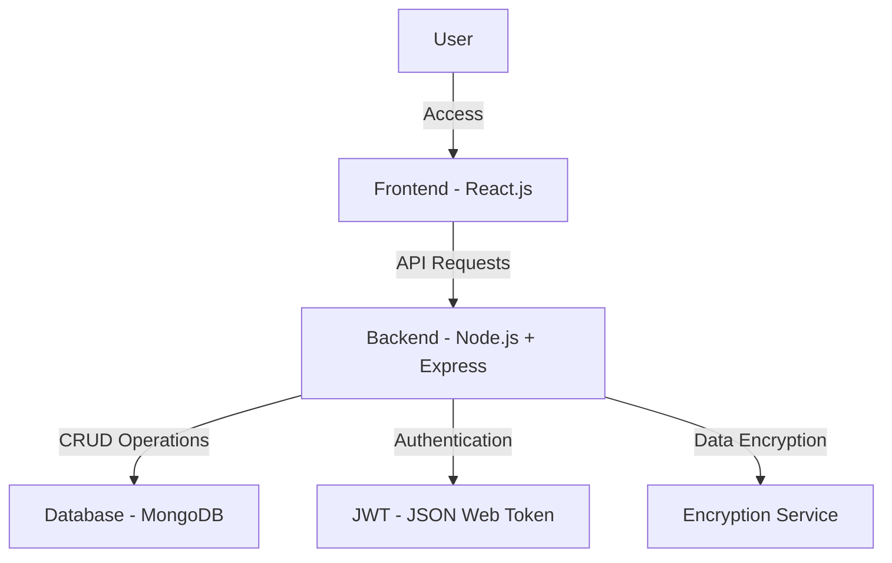
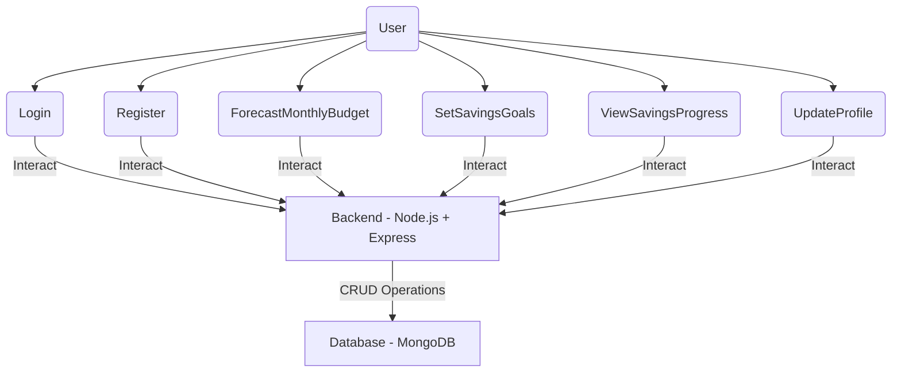
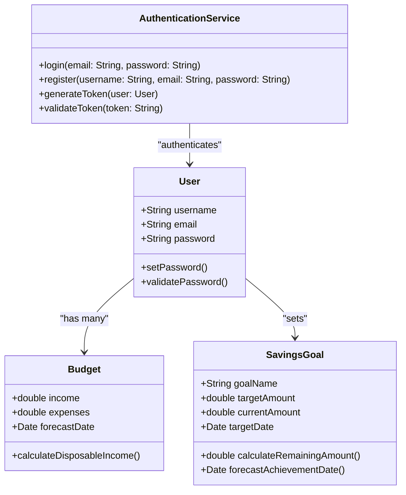
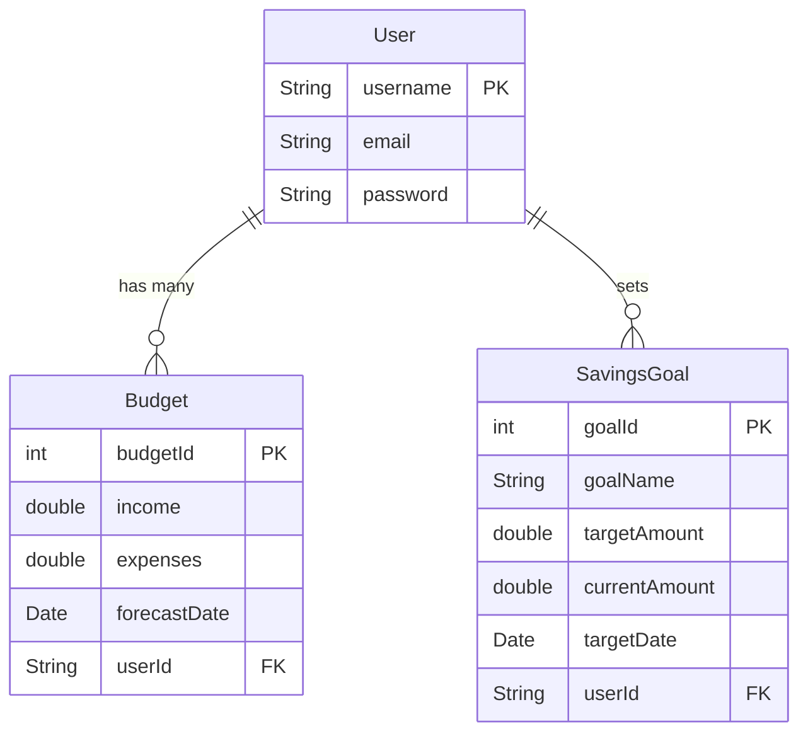

# High-Level Design Document for Budget Forecasting Application

## Introduction
This document provides an overview of the architecture and design of the Budget Forecasting Application. The application aims to help users forecast their budgets, set savings goals, and determine the time required to achieve these goals based on their income.

## System Requirements

### Functional Requirements
1. **Monthly Budget Forecasting**: Users can input their income and expenses to forecast their monthly budgets.
2. **Frequency Specification**: Users can specify the frequency of their income and expenses (weekly, bi-weekly, monthly, etc.).
3. **User Data Retention**: The system will retain user data between sessions.
4. **Data Security**: The system will provide security measures to protect stored user budget data.
5. **Savings Goals**: Users can set savings goals for specific items (e.g., house down payment).
6. **Savings Goal Forecasting**: The system will forecast the time required to achieve savings goals based on a user-specified percentage of their disposable income allocated towards these goals.

### Non-Functional Requirements
1. **OS Compatibility**: The web application will be compatible with Windows, macOS, and Linux operating systems.
2. **Programming Languages**: 
   - Backend: Node.js for building scalable network applications.
   - Frontend: JavaScript (React.js) for creating a responsive and interactive user interface.
3. **Third-Party Libraries**:
   - Backend: Express.js (web framework), Mongoose (for MongoDB object modeling), and JSON Web Token (for authentication).
   - Frontend: React.js (for building user interfaces), Axios (for making HTTP requests).
4. **Additional Requirements**:
   - The system should be scalable to handle multiple users at a time.
   - The application should provide a smooth user experience.
   - The application should comply with standards for data security and privacy.

## Technical Approach

### Backend
- **Framework**: Express.js (Node.js framework)
- **Database**: MongoDB
- **Security**: Implementation of encrypting sensitive data, and secure communication channels (HTTPS).

### Frontend
- **Framework**: React.js
- **State Management**: Redux
- **UI Components**: Material-UI, jQuery or Bootstrap for consistent and responsive design.

### Development Tools
- **Version Control**: Git and GitHub for source code management and collaboration.
- **CI/CD**: GitHub Actions for continuous integration and deployment.
- **Project Management**: Git issue board for task tracking and sprint planning.

## Project Scope

### Team Roles and Responsibilities
- **Project Manager/Scrum Master**: Lalith Adithya Reddy Avuthu
  - Responsibilities: Facilitate meetings, track progress, manage project timeline, resolve conflicts, and ensure team adherence to Agile practices.
- **Backend Developer**: Hema Sree
  - Responsibilities: Develop and maintain the server-side logic, database schemas, and integrate the front-end elements with the backend services. Ensure security and data protection.
- **Frontend Developer**: Lalith Adithya Reddy
  - Responsibilities: Design and implement the user interface, integrate with backend services, ensure responsive design, and enhance user experience.
- **Quality Assurance Tester**: Lalith Adithya Reddy, Hema Sree
  - Responsibilities: Develop and execute test plans, identify and report bugs, ensure the application meets quality standards, and validate user requirements.

### Task Allocation and Workflow
- **Sprint Planning**: Steps will be disaggregated into user stories and distributed within the team given the personnel with relevant skills and availability. Each Sprint will be designed with certain objectives and achievements in mind.
- **Code Reviews**: All code changes must go through a peer review process to maintain code quality and encourage knowledge sharing.
- **Unit Testing**: Continuous testing practices will be followed, with unit tests running to catch issues early.
- **Documentation**: Comprehensive documentation will be maintained.

## Diagrams

### 1. High-Level Architecture Diagram

### 2. Use Case Diagram

### 3. Component Diagram

### Entity-Relationship Diagram

## UML Notation

- **Classes**: User, Budget, Goal
- **Relationships**: 
  - User has a one-to-many relationship with Budget.
  - User has a one-to-many relationship with Goal.
  
This high-level design document provides an overview of the architecture and design for the Budget Forecasting Application. It will evolve as the project progresses, but it defines the critical pieces known at this stage.